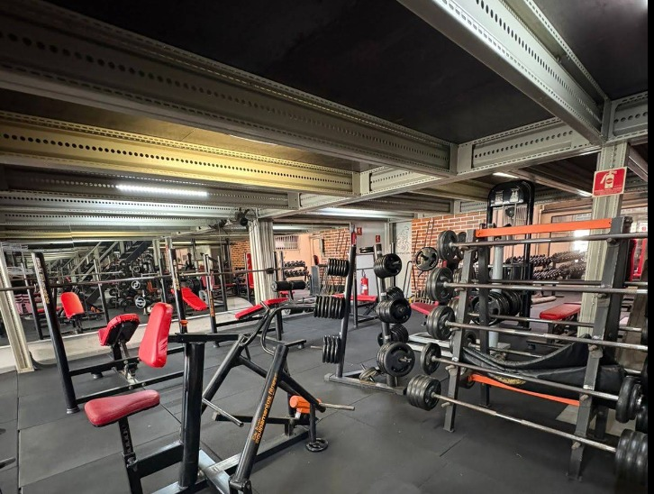

# Entrega 1 — Modelo Conceitual (DER)
### Modelagem de um sistema de gestão de informações para a X Personal Studio

## Metadados

- **Nomes dos alunos e RGM:**
  - Guilherme Lima de Souza
  - Guilherme Miranda Sena
  - Guilherme Vilela Frassão
  - Nathan de Oliveira Tavares
  - Kaue Dogani Moreira 

---

## Introdução

A organização e o controle adequado das informações são importantes para o funcionamento de uma academia, principalmente quando existem diversos frequentadores, funcionários, planos, matrículas, avaliações físicas e fichas de treino.

A **X Personal Studio**, localizada em São Paulo - SP, atua no segmento de atividades físicas, com foco na prática de musculação. A academia possui aproximadamente 15 funcionários e oferece planos destinados aos frequentadores.

Atualmente, parte das informações relacionadas aos frequentadores e aos seus treinos é registrada por meio de fichas físicas em papel. Esse tipo de controle pode dificultar a organização, atualização, consulta e manutenção dos dados.

Diante desse cenário, o presente projeto tem como objetivo realizar a modelagem conceitual de um sistema de gerenciamento de informações para a X Personal Studio. O modelo busca representar os principais dados e processos da organização, considerando frequentadores, funcionários, matrículas, planos, fichas de treino e avaliações físicas.

O projeto está delimitado à etapa de levantamento e organização dos requisitos e à elaboração do Modelo Entidade-Relacionamento (DER), não contemplando, nesta etapa, a implementação do banco de dados ou o desenvolvimento completo do sistema.

---

## 1. Caracterização da Organização

- **Nome e natureza da organização:** X Personal Studio — academia de musculação, com fins lucrativos, situada em São Paulo - SP.
- **Contexto e porte:** organização de pequeno porte, com aproximadamente 15 funcionários (entre instrutores, recepcionistas e equipe de limpeza) e cerca de 200 frequentadores inscritos. O volume de atividades inclui matrículas, renovações de plano, atendimentos diários de treino e avaliações físicas periódicas.
- **Problemas e necessidades identificados:** a principal problemática é a **ausência de um sistema específico para o gerenciamento das informações**. Parte dos dados de frequentadores e de seus treinos ainda é registrada em fichas físicas de papel, dificultando a organização, atualização, consulta e manutenção dessas informações.
- **Justificativa da escolha:** a organização foi escolhida pela facilidade de comunicação com os envolvidos e pelo acesso direto do grupo ao local, além de apresentar relações claras entre diferentes tipos de informação (frequentadores, planos, matrículas, treinos e avaliações), o que a torna um bom caso para a modelagem de um banco de dados nesta etapa do curso.
- **Evidências da organização:**

  
  
  

  - **Endereço completo:** R. Refinaria Mataripe, 577 - Vila Antonieta, São Paulo - SP, 03477-010
  - **Contato:** (11) 97730-5571
  - **Link da organização no Google:** https://maps.app.goo.gl/m8Gxc1dbQbyhHKc8A

---

## 2. Processos de Negócio

- **Principais processos mapeados:** o sistema contempla o cadastro e gerenciamento de frequentadores (alunos), funcionários, planos e matrículas, além do controle de pagamentos e da frequência de acesso. Também são realizados processos relacionados ao acompanhamento físico e ao treinamento dos alunos, como o registro e gerenciamento de avaliações físicas e a criação, consulta, alteração e exclusão de fichas de treino pelos instrutores.
  - O **atendente** consulta informações de planos, matrículas, pagamentos e frequência.
  - O **instrutor** gerencia as fichas de treino e as avaliações físicas.
  - O **aluno (frequentador)** consulta seu plano, sua matrícula, sua ficha de treino e sua avaliação física.
- **Fluxo simplificado:** frequentador procura a academia → cadastro do frequentador → contratação de um plano, com abertura de uma matrícula vinculando frequentador e plano → a critério da equipe, é elaborada uma ficha de treino para o frequentador → periodicamente, um funcionário conduz uma avaliação física do frequentador, registrando peso, altura e demais medidas → o histórico de matrículas, fichas e avaliações compõe o acompanhamento do frequentador ao longo do tempo.

---

## 3. Requisitos do Sistema

### 3.1 Requisitos Funcionais

1. **Cadastrar frequentadores** — o sistema deve permitir cadastrar o ID, nome, CPF e informações de pagamento do frequentador.
2. **Cadastrar matrículas** — o sistema deve permitir registrar a matrícula de um frequentador, incluindo data de início, data final e status.
3. **Cadastrar planos** — o sistema deve permitir cadastrar planos, seus respectivos nomes/descrições e valor mensal.
4. **Relacionar frequentadores aos planos** — o sistema deve permitir associar uma matrícula a um plano contratado.
5. **Cadastrar fichas de treino** — o sistema deve permitir criar fichas de treino contendo data de criação, data de revisão e objetivo.
6. **Relacionar fichas de treino aos frequentadores** — o sistema deve permitir associar uma ficha de treino a um frequentador.
7. **Cadastrar funcionários** — o sistema deve permitir cadastrar funcionários com nome, CPF, cargo, especialidade e senha.
8. **Relacionar funcionários às avaliações físicas** — o sistema deve permitir identificar o funcionário responsável pela realização de cada avaliação física.
9. **Cadastrar avaliações físicas** — o sistema deve permitir registrar avaliações físicas com data, peso, altura, percentual de gordura e observações médicas.
10. **Manter histórico de avaliações** — o sistema deve permitir acompanhar as avaliações físicas realizadas ao longo do tempo.
11. **Controlar situação da matrícula** — o sistema deve permitir consultar e atualizar o status da matrícula.
12. **Controlar informações de pagamento** — o sistema deve permitir registrar e consultar a situação do pagamento do aluno.

### 3.2 Requisitos Não Funcionais

1. **Segurança** — as senhas dos funcionários devem ser protegidas (armazenadas de forma criptografada) e acessíveis somente por usuários autorizados.
2. **Integridade dos dados** — cada frequentador, funcionário, matrícula, plano, ficha de treino e avaliação física deve possuir um identificador único.
3. **Identificação** — o CPF deve ser utilizado para identificar unicamente o frequentador e o funcionário.
4. **Confiabilidade** — as informações cadastradas devem ser armazenadas de forma consistente, evitando perda ou alteração indevida dos dados.
5. **Usabilidade** — o sistema deve permitir que os usuários realizem cadastros e consultas de maneira organizada e compreensível.
6. **Privacidade** — informações pessoais e observações médicas devem ser acessíveis somente aos usuários autorizados.
7. **Manutenibilidade** — o sistema deve permitir a atualização das informações de matrícula, ficha de treino, avaliação física e demais registros.
8. **Rastreabilidade** — as datas de criação, revisão, início, encerramento e avaliação devem ser armazenadas para permitir o acompanhamento histórico dos registros.

---

## 4. Regras de Negócio

- **Regras operacionais:**
  1. Uma matrícula só pode ser aberta se estiver associada a exatamente um plano vigente.
  2. Uma matrícula só é considerada ativa se o pagamento correspondente estiver em dia; caso contrário, seu status deve ser atualizado para inadimplente/suspensa.
  3. Uma ficha de treino só pode ser criada para um frequentador que possua matrícula ativa.
  4. Toda ficha de treino deve estar associada a exatamente um frequentador (não pode existir ficha "solta").
  5. Toda avaliação física deve ser conduzida e registrada por um funcionário responsável (instrutor), e deve estar associada a exatamente um frequentador.
  6. Um frequentador pode possuir várias matrículas ao longo do tempo (histórico de renovações), mas apenas uma matrícula deve estar ativa por vez.
  7. Um plano pode estar associado a nenhuma ou a várias matrículas, mas uma matrícula pertence a exatamente um plano.

- **Restrições organizacionais:**
  - O sistema deve preservar a privacidade das informações dos frequentadores e funcionários; os dados devem ser acessados somente por pessoas autorizadas pela organização.
  - Informações utilizadas como exemplos na documentação do projeto devem ser fictícias — não devem ser usados dados reais de frequentadores ou funcionários, mesmo que observados durante a pesquisa de campo.
  - Observações médicas registradas nas avaliações físicas são consideradas dado sensível e exigem controle de acesso mais restrito.

---

## 5. Dicionário de Dados Conceitual (Preliminar)

Para acessar o Dicionário de Dados completo (HTML), acesse:
[Dicionário de Dados](./dicio_dados/dicionario.html)

O dicionário contempla, para cada entidade (Funcionário, Frequentador, Matrícula, Plano, Ficha de Treino e Avaliação Física), seus atributos, descrições e regras de negócio associadas, seguindo o modelo de tabela padronizado (Atributo | Descrição | Regra de negócio).

---

## 6. Modelagem Conceitual (Entidades, Atributos, Relacionamentos)

- **Entidades reconhecidas:**

  - **Frequentador:** representa a pessoa que utiliza os serviços oferecidos pela X Personal Studio. É a entidade central do modelo, relacionada às matrículas, fichas de treino e avaliações físicas.
  - **Matrícula:** representa o vínculo do frequentador com a academia, registrando data de início, data final e status.
  - **Plano:** representa os planos oferecidos pela academia aos seus frequentadores.
  - **Ficha de Treino:** representa o registro utilizado para organizar as informações do treino do frequentador, incluindo objetivo e datas de criação/revisão.
  - **Funcionário:** representa os profissionais da organização responsáveis por determinadas ações relacionadas aos frequentadores (ex.: condução de avaliações físicas).
  - **Avaliação Física:** representa os registros obtidos durante o acompanhamento físico do frequentador, incluindo medidas corporais e observações médicas.

- **Atributos e classificações:** cada entidade possui um identificador único (`id`) como chave primária, além de atributos que representam suas características específicas (ex.: `nome`, `cpf`, `data_inicio`, `peso`, `objetivo`). Os detalhes completos estão no [Dicionário de Dados](./dicio_dados/dicionario.html).

- **Relacionamentos pertinentes:**
  - **recebe** conecta Frequentador e Ficha de Treino: um frequentador pode receber nenhuma ou várias fichas de treino ao longo do tempo; toda ficha pertence a exatamente um frequentador.
  - **possui** conecta Frequentador e Matrícula: um frequentador possui uma ou mais matrículas (histórico de renovações); toda matrícula pertence a exatamente um frequentador.
  - **compõe** conecta Matrícula e Plano: um plano pode compor nenhuma ou várias matrículas; toda matrícula está associada a exatamente um plano.
  - **possui** conecta Frequentador e Avaliação Física: um frequentador pode possuir nenhuma ou várias avaliações físicas; toda avaliação física pertence a exatamente um frequentador.
  - **avalia** conecta Funcionário e Avaliação Física: um funcionário pode realizar nenhuma ou várias avaliações físicas; toda avaliação física é conduzida por exatamente um funcionário.

- **Restrições e políticas organizacionais aplicadas ao modelo:** o modelo garante que registros como matrículas, avaliações e fichas de treino não existam sem associação a um frequentador (evitando registros órfãos), e considera a necessidade de controle de acesso e proteção dos dados pessoais e médicos armazenados no sistema.

---

## 7. Diagrama Entidade-Relacionamento (DER)

Para acessar o Diagrama Entidade-Relacionamento, acesse:
[DER](./diagramas/der_corrigido.png)

O diagrama representa as 6 entidades (Frequentador, Matrícula, Plano, Ficha de Treino, Funcionário e Avaliação Física), seus atributos (com identificação das chaves primárias), os 5 relacionamentos descritos na Seção 6 e as respectivas cardinalidades em notação Chen (mín, máx). O modelo evita relacionamentos N:M não justificados, mantendo todas as associações em cardinalidade 1:N com entidades associativas explícitas (Matrícula) onde havia potencial ambiguidade — o que garante consistência e facilita a evolução do modelo em etapas futuras (ex.: inclusão de pagamentos detalhados, exercícios vinculados às fichas de treino, controle de frequência/acesso).

---

## 8. Justificativa Técnica

A modelagem foi desenvolvida considerando os principais processos e informações identificados na X Personal Studio.

A entidade **Frequentador** foi definida como uma das principais entidades do modelo por representar as pessoas que utilizam os serviços da academia. A partir dela são estabelecidos relacionamentos com matrícula, ficha de treino e avaliação física.

A entidade **Matrícula** foi separada da entidade Frequentador para representar o vínculo do aluno com a academia e armazenar informações específicas desse processo (data de início, data final e status), permitindo manter um histórico de renovações sem sobrescrever dados anteriores.

A entidade **Plano** foi criada para representar os diferentes planos oferecidos pela organização. Essa separação evita a duplicação de informações do plano em cada matrícula e permite que planos sejam cadastrados, alterados ou descontinuados de forma independente.

A entidade **Ficha de Treino** representa uma informação específica do acompanhamento do frequentador. Seus atributos permitem registrar o objetivo, a data de criação e a data de revisão da ficha.

A entidade **Avaliação Física** foi criada para organizar os dados relacionados ao acompanhamento físico dos frequentadores, permitindo registrar peso, altura, percentual de gordura, observações médicas e data da avaliação. Optou-se por vincular cada avaliação a **exatamente um** frequentador e a **exatamente um** funcionário responsável (cardinalidade 1:N em ambos os lados, e não N:M), pois uma avaliação física é, por natureza, um evento individual conduzido por um único profissional em um único aluno — essa escolha evita ambiguidades de autoria e de titularidade do registro.

A entidade **Funcionário** representa os profissionais envolvidos na organização e permite relacionar o responsável à realização das avaliações físicas.

A utilização de entidades separadas (em vez de agrupar tudo em Frequentador) reduz a repetição de informações e permite que o modelo seja ampliado futuramente — por exemplo, com o detalhamento de pagamentos, exercícios associados às fichas de treino, ou controle de frequência/acesso — sem a necessidade de alterar completamente sua estrutura conceitual.

As cardinalidades foram definidas de acordo com os vínculos reais observados na organização, buscando garantir que as informações permaneçam relacionadas de maneira coerente entre frequentadores, matrículas, planos, fichas de treino, funcionários e avaliações físicas, e evitando relacionamentos muitos-para-muitos que não correspondem à realidade do negócio.

---

## 9. Uso de Inteligência Artificial

Durante a elaboração do projeto, foi utilizada a ferramenta **ChatGPT** como apoio à organização e revisão da documentação do trabalho. Posteriormente, o grupo também utilizou o **Claude (Anthropic)** para revisar a consistência entre o README, o Dicionário de Dados e o Diagrama Entidade-Relacionamento, e para corrigir divergências encontradas entre esses três artefatos.

| Item | O que registrar |
|------|------------------|
| **Ferramenta e etapa** | ChatGPT, utilizado durante a organização e elaboração do README.md, estruturação dos requisitos, regras de negócio e revisão textual. Claude, utilizado para revisar a consistência entre README, Dicionário de Dados e DER, e para regenerar o diagrama corrigido. |
| **Motivação** | Utilizar a ferramenta como apoio para organizar as informações levantadas pelo grupo, estruturar a documentação de acordo com o modelo de entrega proposto e identificar inconsistências entre os artefatos do repositório. |
| **Prompt(s) utilizados** | "Chat me ajuda a montar o README do GitHub"; "monta o texto completo por favor com as suas sugestões"; "Analise esse repositório no GitHub se baseando no esqueleto apresentado do trabalho. Faça uma análise completa..."; "Reescreva e faça todas as correções necessárias". |
| **Resposta recebida** | O ChatGPT auxiliou na organização das informações fornecidas pelo grupo e na estrutura inicial da documentação. O Claude identificou que o DER original ("Exercício"/"acompanha") divergia do README e do Dicionário de Dados (que descreviam Matrícula/Plano), identificou o nome de organização inconsistente ("BlueFit" no dicionário vs. "X Personal Studio" no README), o link de imagem quebrado, a ausência de RGM e de dados de contato/endereço, e a ausência de uma seção formal de Regras de Negócio — e propôs correções para cada ponto. |
| **Fontes consultadas e verificadas** | As informações específicas sobre a X Personal Studio foram fornecidas pelo grupo a partir do levantamento realizado na organização. As sugestões geradas pela IA (estrutura do texto, regras de negócio propostas, diagrama regenerado) foram conferidas pelo grupo antes da versão final. |
| **Trechos rejeitados ou corrigidos** | O diagrama anterior (com a entidade "Exercício" e o relacionamento "acompanha") foi mantido apenas como arquivo de referência histórica, pois não correspondia ao modelo efetivamente documentado no Dicionário de Dados. A cardinalidade N:M entre Frequentador e Avaliação Física foi corrigida para 1:N, por representar melhor a realidade (uma avaliação pertence a um único frequentador). Informações não confirmadas pela organização (endereço, contato, RGM) não foram inventadas — foram deixadas como campos a preencher pelo grupo com dados reais. |
| **Justificativa da escolha final** | As sugestões consideradas compatíveis com a organização e com os processos observados foram adaptadas e utilizadas na documentação. As decisões finais, especialmente sobre quais entidades e cardinalidades representam corretamente o negócio, permanecem sob responsabilidade do grupo. |
| **Reflexão crítica** | A IA foi utilizada como ferramenta de apoio e de revisão de consistência, não como fonte primária das informações da organização. Suas sugestões podem conter generalizações que não correspondam exatamente à realidade observada (por exemplo, as regras operacionais propostas na Seção 4 devem ser validadas junto à administração da academia). Por isso, os requisitos, processos, regras de negócio e dados de contato apresentados devem ser conferidos e, se necessário, ajustados pelo grupo com base na pesquisa de campo antes da entrega final. |
